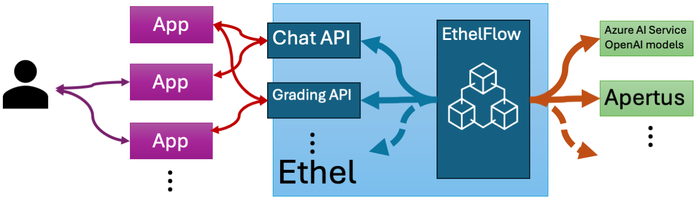

# EthelFlow

## Big picture

EthelFlow is the **runtime and developer toolkit** behind Project Ethel.

At its core, EthelFlow provides:

- A **LangGraph-based orchestration service** (the `ethelflow` FastAPI app) that runs explicit *flows* (small state machines).
- A set of **agent microservices** (chunking, embeddings, vector search, reasoning, file-to-text, file-to-images, etc.) that flows call over HTTP.
- A **versioned asset store** (virtual filesystem) backed by **Postgres metadata** + **S3/MinIO** object storage.
- A **ChatAPI surface** that looks like the OpenAI API (`/v1/chat/completions`, `/v1/responses`) but is backed by EthelFlow flows and internal state.
- A **Pod-based state layer** in Postgres for:
  - **conversation pods** (chat history + per-conversation state)
  - **environment pods** (course/environment configuration like templates, intent options, and reference document sets), designed to “follow latest”.

Model/provider routing is **catalog-driven**:

- A model catalog YAML defines **tenants**, embedding **spaces**, inference **classes**, and provider/deployment wiring.
- Flows and agents route primarily on `tenant` (and optional hints like `embedding_space` / `inference_class`).

If you are new to the codebase, start with:
- `ethelflow/ethelflow/README.md` — the main service internals and APIs
- `ethelflow/ethelflow/apis/README.md` — API surfaces (ChatAPI/Admin/Common) and how to add new ones
- `ethelflow/ethelflow/data/README.md` — database schema and storage layer

---

## What is being built here

This repo is building a **multi-tenant, Kubernetes-native retrieval + orchestration platform** for education-focused AI experiences.

The intended pattern is:

1. **Ingest & version content** into the assets store (`/assets`).
2. **Process content** via agent pipelines (extract → chunk → embed → store vectors).
3. **Serve experiences** through:
   - **Flows API** (developer-oriented orchestration runs)
   - **ChatAPI** (OpenAI-compatible entry point for “oblivious” clients like LMS/LTI integrations)
4. **Configure environments** (course templates, references, intent definitions) via **environment pods** (Admin API today; authz later).

---

## Repository structure (high level)

> This section makes minimal assumptions and only lists directories/files referenced elsewhere in the repo and tooling.

- `ethelflow/`
  - The Python package and main FastAPI service.
  - Contains flows, node adapters, DB models/utilities, and API routers.

- `alembic/`
  - Alembic migration environment and revisions for Postgres schema evolution.

- `k8s/`
  - Kubernetes manifests for the main service and agent microservices.
  - Typically includes the model catalog ConfigMap and deployment/service YAML.

- `scripts/`
  - Helper scripts for local/dev cluster setup (e.g., creating Secrets).

- `debug/`
  - Developer utilities for running smoke tests, inspecting logs, and iterating locally.

- `overview_ethelflow.png`
  - Architecture diagram referenced above.

- `ethelflow.Dockerfile`
  - Container build definition for the main service image.

- `update_embedding_dbs.py` (if present)
  - Helper script that generates Alembic revisions for catalog-defined embedding tables.
  - If you use it, treat it as a convenience tool; the source of truth remains migrations + the catalog.

---

## Runtime architecture

In a typical microk8s/minikube deployment you get:

- `ethelflow` (FastAPI) — public entry point, orchestration, assets, chat-style API
- `postgres` — metadata DB, checkpoints, pods, chunks, etc.
- `minio` — S3-compatible object storage for document bytes and derived artifacts
- Agent services — independent Deployments (embedding, reasoning, search-vectors, store-vectors, file-to-text, chunk-text, retrieve-chunks, …)

---

## Extending the system

### Adding a new API surface

Create a new package under `ethelflow/ethelflow/apis/<your_api>/` and follow the existing pattern:

- Define a `router.py` with an `APIRouter(prefix=..., tags=[...])`.
- Use shared dependencies from `ethelflow/ethelflow/apis/common/deps.py`:
  - `get_checkpointer()` if you run flows
  - `get_pod_store()` if you store state/config in pods
- Register the router in `ethelflow/ethelflow/__main__.py`.

If your API needs “environment-like” configuration (templates, references, per-course settings), store it in an **environment pod** rather than hard-coding it into clients:
- Key environments by `(owner_api, tenant, env_type, env_id)` and store schema-less JSON under `config`.
- Keep routing logic in the API small; let flows interpret the environment config they care about.

### Adding a new flow

Add a module under `ethelflow/ethelflow/flows/` with a `run(...)` entry point (see `ethelflow/ethelflow/README.md` and `ethelflow/ethelflow/flows/README.md` if present).

Guidelines:
- Treat `tenant` as a required routing input.
- Keep the flow state JSON-serializable (UUIDs as strings across service boundaries).
- Prefer node adapters in `ethelflow/ethelflow/agents/*/node_adapter.py` to call services.

### Adding a new agent microservice

Agents typically have:
- a FastAPI service (HTTP interface)
- a node adapter used by flows to call it
- a k8s Deployment/Service definition

Keep the node adapter contract stable and documented; flows should depend on the adapter, not on raw HTTP details.

---

## Development notes

- Kubernetes is the intended runtime (microk8s is a common dev setup).
- Database schema changes should go through Alembic (`alembic revision …`, `alembic upgrade head`).
- The model catalog is mounted into each service and provides tenant-aware routing (providers, spaces, inference classes). Secrets (API keys) live in environment variables / Kubernetes Secrets, not in git.

For concrete usage and endpoints, see the per-package READMEs in `ethelflow/ethelflow/`.
